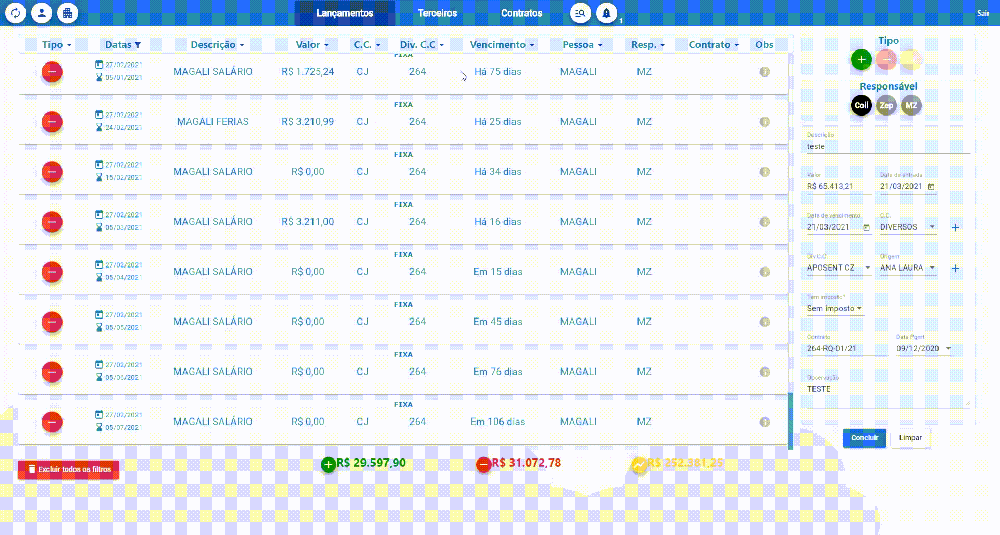
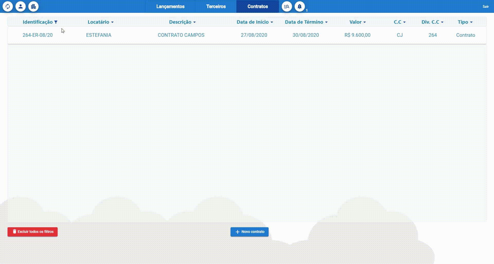

# ZepCoil

This projects consists in a tool to manage renting contracts and all the incomes and outcomes of the renting process. It was developed to a specific client with very specific requirements.

This github page has the only purpose to show my work. This project is missing crucial files with classified information. It will be possible to build it, but logging in will not be.

This project was developed using Angular 9.0.1. Backend uses AWS MySQL and Node.js.

Some usage examples can be seen in the gifs below (the presented values and names are fake).

Main page with a scroll at the center and all the entries made by the user. UX/UI improved by colors, icons and well designed css.
*Menu on the right side of the page was a strict requirement made by the client.

Filters were designed to look like MS Excel. Some frequent options can be access simply by clicking the extra buttons, like "today", "this month" and so forth.

The page design changes between pages but the filter feature is still accessible.

Exemple of a form accessible via a button at the bottom of the page.

These are only examples. There is much more in the app: CRUD for renting places and responsible third parties, reports, contract due date alerts, login page and so on.
